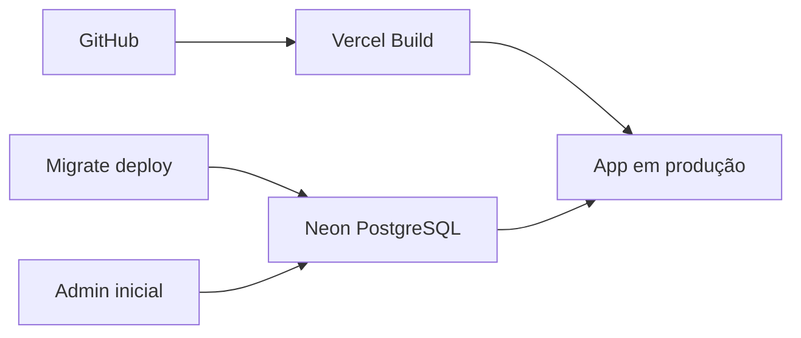

# Plano de Implementação — Biblioteca Espírita

**Versão do plano:** 0.0.1  
**Última atualização:** julho/2026  
**Objetivo:** colocar o sistema em ambiente contínuo (ongoing) para uso diário pela biblioteca de uma instituição religiosa espírita.

---

## Visão geral

O MVP de software está funcional em desenvolvimento. Este plano cobre infraestrutura, ajustes técnicos de produção e operação contínua — em etapas sequenciais com checklist.



---

## Fase 0 — Baseline (v0.0.1) ✅ em andamento

Preparar o repositório para deploy seguro, sem rodar seed de demonstração em produção.

| # | Tarefa | Status |
|---|--------|--------|
| 0.1 | Documentar plano em `doc/plano-de-implementacao.md` | ✅ |
| 0.2 | Versão `0.0.1` no `package.json` + `CHANGELOG.md` | ✅ |
| 0.3 | Schema Prisma em PostgreSQL + migration inicial versionada | ✅ |
| 0.4 | Ajustar `vercel.json` (build sem seed automático) | ✅ |
| 0.5 | Workflow CI (lint, build, `migrate deploy`) | ✅ |
| 0.6 | Separar seed de dev (`SEED_DEMO`) e script `create-admin` para produção | ✅ |
| 0.7 | Atualizar `.env.example` e `README` com fluxo PostgreSQL | ✅ |

**Entregável:** projeto pronto para conectar Vercel + Neon sem perder dados a cada deploy.

---

## Fase 1 — Infraestrutura (go-live)

### 1.1 Repositório e hospedagem

| Componente | Serviço | Função |
|------------|---------|--------|
| Código | **GitHub** | Repositório + deploy automático |
| Aplicação | **Vercel** | Next.js, HTTPS, domínio |
| Banco | **Neon** (PostgreSQL) | Acervo, usuários, empréstimos |
| Domínio | Opcional | Ex.: `biblioteca.seucentro.org.br` |

**Checklist:**

- [ ] Criar repositório no GitHub e enviar o código
- [ ] Conectar repositório à Vercel
- [ ] Criar projeto no [Neon](https://neon.tech)
- [ ] Copiar connection string do Neon (`?sslmode=require`)

### 1.2 Variáveis de ambiente (Vercel)

| Variável | Valor | Obrigatório |
|----------|-------|-------------|
| `DATABASE_URL` | Connection string do Neon | Sim |
| `AUTH_SECRET` | Secret aleatório (32+ caracteres) | Sim |
| `NEXTAUTH_URL` | URL pública do app | Sim |
| `SEED_DEMO` | `false` em produção | Sim |

Gerar `AUTH_SECRET`:

```bash
openssl rand -base64 32
```

### 1.3 Primeiro deploy

1. Configurar variáveis na Vercel
2. Fazer push na branch `main` (CI roda lint + build)
3. Rodar migration no Neon (via CI ou manual):

   ```bash
   npm run db:migrate:deploy
   ```

4. Criar administrador real (não usar credenciais do seed):

   ```bash
   npm run admin:create -- --email admin@centro.org.br --name "Bibliotecário" --password "senha-forte"
   ```

5. Acessar `/login` e validar acesso admin
6. Cadastrar primeira obra e exemplar de teste
7. Testar empréstimo e devolução
8. Validar catálogo público em `/catalogo`

**Checklist go-live:**

- [ ] PostgreSQL (Neon) com migration aplicada
- [ ] Vercel com variáveis configuradas
- [ ] Seed de demonstração **desativado** (`SEED_DEMO=false`)
- [ ] Admin real criado com senha forte
- [ ] URL estável comunicada à instituição
- [ ] Fluxo completo testado (obra → exemplar → empréstimo → devolução → catálogo)

---

## Fase 2 — Operação contínua

### 2.1 Rotina da biblioteca

| Atividade | Responsável | Frequência |
|-----------|-------------|------------|
| Cadastro de obras e exemplares | Bibliotecário (ADMIN) | Conforme chegam livros |
| Cadastro de leitores | Bibliotecário | Quando alguém se associa |
| Empréstimos e devoluções | Bibliotecário | Diário |
| Consulta pública | Leitores / visitantes | Livre em `/catalogo` |

### 2.2 Campos do acervo (obras espíritas)

**Obrigatórios:** título e autor.

| Campo | Descrição |
|-------|-----------|
| `subtitle` | Subtítulo |
| `medium` | Médium (ex.: Francisco Cândido Xavier) |
| `workType` | Codificação, Psicografado, Ditado, etc. |
| `isbn` | ISBN |
| `publisher` | Editora |
| `year` | Ano de publicação |
| `edition` | Edição |
| `collection` | Coleção/série (ex.: Série André Luiz) |
| `pages` | Páginas |
| `language` | Idioma |
| `synopsis` | Sinopse |
| `notes` | Notas catalográficas |
| `categories` | Gêneros (Codificação Kardecista, Romance Espírita, etc.) |

### 2.3 Rotina técnica

| Atividade | Frequência |
|-----------|------------|
| Backup do Neon (verificar retenção no plano) | Contínuo (automático Neon) |
| Atualizar dependências (`npm audit`) | Mensal / trimestral |
| Monitorar erros (Vercel Logs) | Semanal |
| Revisar usuários ADMIN ativos | Semestral |
| Revisar política de CPF (LGPD) | Anual |

### 2.4 Desenvolvimento local

```bash
docker compose up -d          # PostgreSQL local
copy .env.example .env
npm install
npm run db:setup              # migrate + seed demo (SEED_DEMO=true)
npm run dev
```

Credenciais de demonstração (somente com `SEED_DEMO=true`):

| Perfil | E-mail | Senha |
|--------|--------|-------|
| Admin | `admin@biblioteca.local` | `admin123` |
| Leitor | `maria@email.com` | `leitor123` |

---

## Fase 3 — Segurança e conformidade

| # | Tarefa | Prioridade | Status |
|---|--------|------------|--------|
| 3.1 | Política de senhas fortes para admins | Alta | Parcial (script `admin:create` exige 8+) |
| 3.2 | Tratamento de CPF e LGPD | Alta | ✅ Ver `doc/lgpd-pontos-de-atencao.md` |
| 3.3 | Rate limit em `/api/chat` e rotas públicas | Média | ✅ `src/lib/rate-limit.ts` |
| 3.4 | Ambiente de homologação (branch `staging` + Neon separado) | Média | Pendente |
| 3.5 | Logs de auditoria (quem cadastrou/emprestou) | Baixa | Pendente |

**Implementado na Fase 3.2:**
- `/privacidade`, `/termos`, `/lgpd`
- Aceite no cadastro (admin) e no 1º acesso (`/privacidade/aceite`)
- `/meus-dados` e `/lgpd/solicitacoes`
- Registro de consentimento no banco (versão, data, método)
- CPF mascarado em listagens

---

## Fase 4 — Evoluções (pós go-live)

| # | Funcionalidade | Versão alvo |
|---|----------------|-------------|
| 4.1 | Edição de obras (hoje: cadastro + visualização) | 0.1.0 |
| 4.2 | Importação de acervo via CSV/planilha | 0.2.0 |
| 4.3 | Relatórios (mais emprestados, atrasos) | 0.2.0 |
| 4.4 | E-mail de lembrete de devolução | 0.3.0 |
| 4.5 | Multas por atraso | 0.4.0 |

---

## Referência de comandos

| Comando | Uso |
|---------|-----|
| `npm run db:setup` | Dev: generate + migrate + seed demo |
| `npm run db:migrate:deploy` | Produção: aplicar migrations pendentes |
| `npm run db:seed` | Seed demo (requer `SEED_DEMO=true`) |
| `npm run admin:create` | Criar admin em produção |
| `npm run build` | Build de produção |
| `npm run dev` | Servidor local |

---

## Custos estimados

| Cenário | Custo mensal aproximado |
|---------|-------------------------|
| MVP pequeno (plano gratuito Vercel + Neon) | R$ 0 |
| Uso moderado (mais tráfego / storage) | R$ 50–150 |
| VPS própria (alternativa) | R$ 30–80 + manutenção manual |

**Recomendação:** Vercel + Neon para instituições sem equipe de TI dedicada.

---

## Histórico de versões do plano

| Versão | Data | Alteração |
|--------|------|-----------|
| 0.0.1 | jul/2026 | Plano inicial + baseline técnica para produção |
